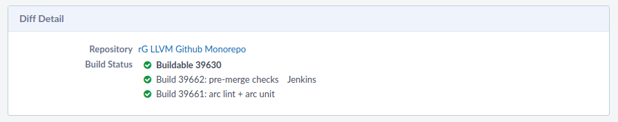
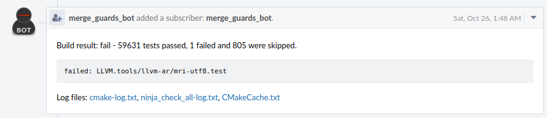

# Sign up for beta test

To sign up for the pre-merge tests, please add your user id to the [Herald rule](https://reviews.llvm.org/H511) triggering the builds. If you can't modify the rule yourself, please add a comment to [this issue](https://github.com/google/llvm-premerge-checks/issues/54) with your **Phabricator user name** and we'll add you.

# Integration in Phabricator

Once you're signed up, Phabricator will automatically trigger a build for every new patch you upload or every existing patch you modify. Phabricator shows the build results at the top of the entry:

If a unit test failed, this is shown below the build status. You can also expand the unit test to see the details:

After every build the build server will comment on your latest patch, so that you can also see the results for previous changes. The comment also contains a link to the log files:

The build logs are stored for 90 days and automatically deleted after that.

You can also trigger a build manually by using the "Run Plan Manually" link on the [Harbormaster page](https://reviews.llvm.org/harbormaster/plan/3/) and entering a revision ID in the pop-up window.

# Reporting issues

If you notice any bugs, please create a [new issue](https://github.com/google/llvm-premerge-checks/issues/new).
